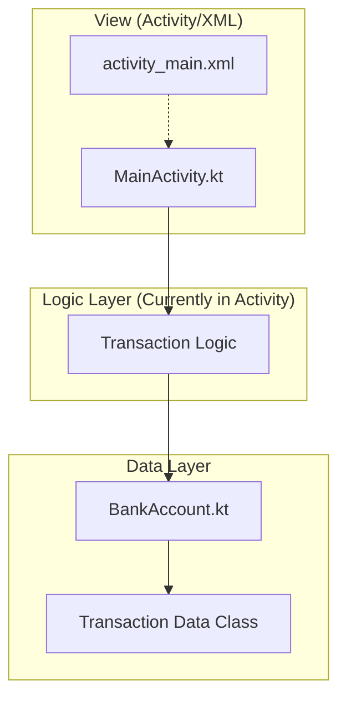
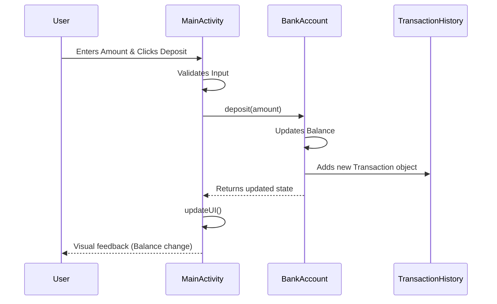

# 🏦 Bank Account Program - Kotlin Learning Journey

  
  
  
  

## 🌟 Overview

Welcome to my **Bank Account Program**! This is a personal educational project developed to master the fundamentals of **Kotlin** and **Android Development**. The core objective was to build a robust, interactive banking simulation while adhering to modern development standards and architectural patterns.

This project serves as a cornerstone of my Android learning path, demonstrating proficiency in state management, UI design, and object-oriented principles in Kotlin.

---

## 🎨 Visual Showcase

> [!TIP]
> This section showcases the interactive UI of the application.

  <table>
    <tr>
      <td align="center"><b>Main Dashboard</b></td>
      <td align="center"><b>Transaction Success</b></td>
    </tr>
    <tr>
      <td></td>
      <td></td>
    </tr>
    <tr>
      <td align="center"><i>Visualizing current balance and action cards</i></td>
      <td align="center"><i>Real-time history updates</i></td>
    </tr>
  </table>

---

## 🏗 Architecture & Design

### 📐 MVVM Architecture
The project follows the **Model-View-ViewModel** pattern to ensure a clean separation of concerns, making the code testable and maintainable.

### 🔄 App Flow
The following diagram illustrates how a user interaction triggers a data update and UI refresh:

---

## 🚀 Key Features

- **✅ Structured Data**: Leverages Kotlin `data class` and `enum class` for clean transaction modeling.
- **✅ Real-time Validation**: Robust checks for numerical input, positive values, and overdraft protection.
- **✅ Detailed Auditing**: Every action is timestamped and recorded with a "Balance After" snapshot.
- **✅ Material 3 Design**: Uses `CardView`, `TextInputLayout`, and `MaterialToolbar` for a professional look.
- **✅ Precision Handling**: Uses `String.format` with `Locale.US` to prevent floating-point display errors.

---

## 📊 MAD Score (Modern Android Development)

I have evaluated this project against the **MAD Score** criteria to track my progress in using modern Android tools.

| Category | Tooling | Proficiency |
| :--- | :--- | :--- |
| **Language** | Kotlin (100%) | ⭐⭐⭐⭐⭐ |
| **Build** | Gradle (KTS) | ⭐⭐⭐⭐ |
| **UI** | Material Design / XML | ⭐⭐⭐⭐ |
| **Architecture** | MVVM Pattern | ⭐⭐⭐ |

---

## 🛠 Tech Stack

- **Language:** [Kotlin](https://kotlinlang.org/)
- **UI:** XML (Material Design)
- **Minimum SDK:** 24
- **Target SDK:** 34
- **Build System:** Gradle Kotlin DSL
- **Architecture:** Model-View-ViewModel (MVVM) concept

---

## 📚 Learning Outcomes

Through this project, I have gained hands-on experience in:
1. **Kotlin Fundamentals**: Enums, Data Classes, String Templates, and List Manipulations.
2. **Android Lifecycle**: Managing state within the `onCreate` phase.
3. **UI/UX**: Designing responsive layouts with `LinearLayout`, `ScrollView`, and `CardView`.
4. **Input Handling**: Bridging the gap between user text input and numerical logic.
5. **Formatting**: Implementing localized currency and time formatting.

---